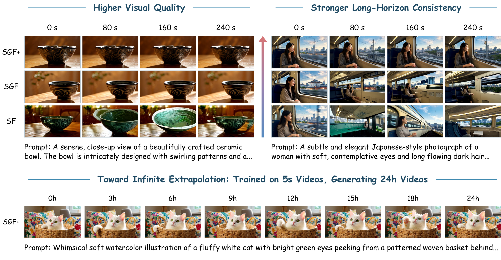
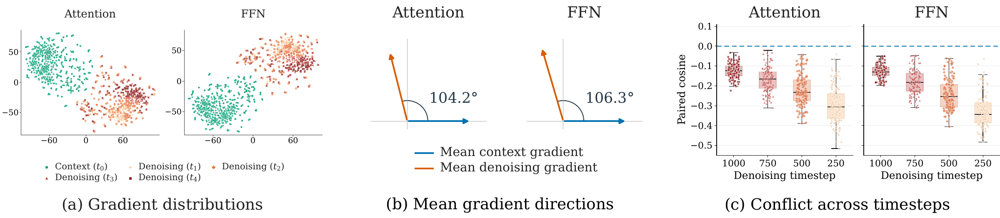
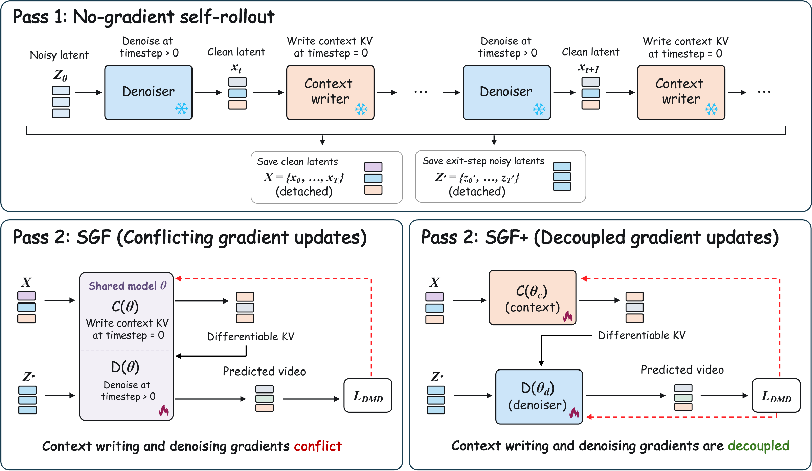

<div align="center">

#  Self Gradient Forcing Plus

### Decoupling Gradient Flows for Autoregressive Video Generation

<p>
  <a href="https://zihan-su.github.io/self-gradient-forcing-plus"></a> &nbsp;
  <a href="https://arxiv.org/abs/2610.10429"></a> &nbsp;
  <a href="https://huggingface.co/ZihanSu/Self_Gradient_Forcing_Plus"></a> &nbsp;
  <a href="LICENSE"></a>
</p>

<p>
  <strong>Zihan Su<sup>1,2*</sup>, Junhao Zhuang<sup>2*†</sup>, Yaowei Li<sup>2</sup>, Siwen Lu<sup>1</sup>, Haoran Li<sup>2</sup>, Lingen Li<sup>3</sup>, Haoyu Wu<sup>2</sup><br>
  Weiyang Jin<sup>2</sup>, Songchun Zhang<sup>2</sup>, Haoyang Huang<sup>2</sup>, Chun Yuan<sup>1†</sup>, Zeyue Xue<sup>2</sup>, Nan Duan<sup>2</sup></strong>
</p>

<p>
  <sup>1</sup>Tsinghua University &nbsp; <sup>2</sup>Joy Future Academy, JD &nbsp; <sup>3</sup>The Chinese University of Hong Kong
</p>

<p><sup>*</sup>Equal contribution. &nbsp; <sup>†</sup>Corresponding authors.</p>

⭐ If Self Gradient Forcing Plus is useful for your research, please consider starring this repository.

</div>

<p align="center">
  
</p>


## 🔥 News

- **2026-10-7**: Paper, model checkpoints, inference scripts, and training code are publicly released.

## 🎬 Video Comparisons

Left to right: **Self Forcing · Self Gradient Forcing · Self Gradient Forcing Plus**. More videos are available on our [project page](https://zihan-su.github.io/self-gradient-forcing-plus).

**By the train window**

https://github.com/user-attachments/assets/1fd94100-b832-4202-80ad-de5c8158f86d

**A tiny monster, a candle**

https://github.com/user-attachments/assets/af3fb848-2927-4b46-b9f6-8d62bd1dd31f

## 🧠 Method Overview

We uncover conflicting gradients between context writing and denoising in SGF. These gradients partially cancel on shared parameters, motivating separate optimization.

<p align="center">
  
</p>

SGF+ separates context-writing and denoising parameters to resolve conflicting gradient updates, improving autoregressive video generation and enabling rollouts of up to 24 hours from only 5s training windows.

<p align="center">
  
</p>

## 🛠️ Installation

The environment follows the SGF setup.

```bash
git clone https://github.com/Zihan-Su/Self_Gradient_Forcing_Plus.git
cd Self_Gradient_Forcing_Plus

conda create -n sgf_plus python=3.10 -y
conda activate sgf_plus
pip install -r requirements.txt
pip install flash-attn --no-build-isolation
python setup.py develop
```

Run the following commands from the repository root.

## ⬇️ Download Weights

```bash
bash scripts/download_weights.sh
```

The script uses the Hugging Face CLI command `hf` by default. Set `HF_CLI=huggingface-cli` if your environment still uses the older command name.

It downloads:

- Wan base models to `wan_models/Wan2.1-T2V-1.3B` and `wan_models/Wan2.1-T2V-14B`.
- [Causal-Forcing](https://github.com/thu-ml/Causal-Forcing) AR initialization checkpoints to `checkpoints/init/chunkwise/ar_diffusion.pt` and `checkpoints/init/framewise/ar_diffusion.pt`.
- Released SGF+ inference checkpoints to `hf_weights/chunkwise/model.pt` and `hf_weights/framewise/model.pt`.
- The training prompt list to `prompts/vidprom_filtered_extended.txt`.

Run `hf auth login` first if authentication is required.

## 🚀 Inference

The default prompt file is `prompts/test_prompt.txt` with 8 prompts. The launcher uses 8 GPUs when at least 8 GPUs are visible; otherwise it falls back to single-GPU serial inference. By default it generates `963` latent frames, which decode to about 240 seconds of video at 16 fps.

The inference script takes the release setting name (`chunkwise` or `framewise`) and a checkpoint path, and selects the matching config automatically:

- chunkwise config: `configs/sgf_plus_chunkwise.yaml`
- framewise config: `configs/sgf_plus_framewise.yaml`

The long-video KV-cache geometry is set in `scripts/infer_self_gradient_forcing.sh`, which is called by the SGF+ launcher. Chunkwise defaults to `KV_CACHE_SINK=3`, `KV_CACHE_FIFO_FRAMES=6`, and `KV_CACHE_CURRENT_FRAMES=3`, so `--kv_cache_max_frames` is `12`. Framewise defaults to `KV_CACHE_SINK=4`, `KV_CACHE_FIFO_FRAMES=16`, and `KV_CACHE_CURRENT_FRAMES=1`, so `--kv_cache_max_frames` is `21`.

### Chunkwise

```bash
bash scripts/infer_sgf_plus.sh chunkwise hf_weights/chunkwise/model.pt
```

This uses:

```text
configs/sgf_plus_chunkwise.yaml
hf_weights/chunkwise/model.pt
```

### Framewise

```bash
bash scripts/infer_sgf_plus.sh framewise hf_weights/framewise/model.pt
```

This uses:

```text
configs/sgf_plus_framewise.yaml
hf_weights/framewise/model.pt
```

### Custom checkpoint or prompt file

```bash
bash scripts/infer_sgf_plus.sh \
  chunkwise \
  hf_weights/chunkwise/model.pt \
  prompts/test_prompt.txt
```

Useful overrides:

```bash
NUM_OUTPUT_FRAMES=963 SEED=42 OUTPUT_ROOT=outputs/demo \
  bash scripts/infer_sgf_plus.sh chunkwise hf_weights/chunkwise/model.pt
```

For trained checkpoints, pass the release setting first and the produced `logs/.../checkpoint_model_*/model.pt` path as the second argument. The script uses EMA weights by default; set `USE_EMA=0` to use the non-EMA `generator` weights.

## ⚡ Inference with Reactor Runtime

The [`reactor/`](reactor/README.md) integration serves SGF+ as an interactive video
model with [Reactor Runtime](https://reactor.inc) and a browser frontend. It uses
the released chunkwise checkpoint on one NVIDIA B200, supports text and optional
reference images, and lets you update the prompt while generation continues.

Install the [Reactor CLI](reactor/README.md#1-install-the-reactor-cli), Docker and
the NVIDIA Container Toolkit. From the repository root, build and start the
service on an available GPU; inference weights download automatically on first startup:

```bash
cd reactor
reactor build
reactor run --gpus device=0 --port 8080
```

Once `http://localhost:8080/health` reports `"state":"available"`, open another
terminal at the repository root and start the frontend (Node.js 22.12+ and npm):

```bash
cd reactor/demo
npm ci
npm run dev
```

Open the printed URL, normally [http://localhost:5173](http://localhost:5173),
set **Runtime URL** to `http://localhost:8080`, and click **Connect**. Enter a
prompt, optionally choose an image, then click **Start new video**. Use
**Update prompt** to change subsequent chunks and **Pause / Resume** to hold or
continue the same video. Playback stays at the original 16 FPS export rate.
See the [Reactor guide](reactor/README.md) for controls, validation and remote
connection requirements, including WebRTC over SSH.

## 🏋️ Training

### Chunkwise SGF+

```bash
bash scripts/train_sgf_plus_chunkwise.sh
```

Equivalent explicit form:

```bash
bash scripts/train_sgf_plus_chunkwise.sh \
  configs/sgf_plus_chunkwise.yaml \
  logs/sgf_plus_chunkwise
```

### Framewise SGF+

```bash
bash scripts/train_sgf_plus_framewise.sh
```

Equivalent explicit form:

```bash
bash scripts/train_sgf_plus_framewise.sh \
  configs/sgf_plus_framewise.yaml \
  logs/sgf_plus_framewise
```

The launchers accept `[config.yaml] [logdir] [extra train.py args...]` and support single-node and multi-node training. Without explicit or scheduler-provided topology settings, nodes auto-register through `.rendezvous/` on the shared filesystem and launch static `torchrun` with an IP master address. For multi-node jobs, run the same command on every node within the gather window.

Useful overrides:

```bash
GATHER_WINDOW=90 NUM_GPUS=8 MASTER_PORT=29501 ENABLE_WANDB=1 \
  bash scripts/train_sgf_plus_chunkwise.sh logs/sgf_plus_chunkwise
```

To specify the topology manually, set `NNODES`, `NODE_RANK`, `MASTER_ADDR` and `MASTER_PORT`. Use a distinct `NODE_RANK` on each node and matching values for the other settings.

## 📊 Gradient Conflict Experiments

To reproduce our gradient-conflict experiments, see the [experiment guide](gradient_conflict/README.md).

## 🙏 Acknowledgements

This repository builds on [Self Gradient Forcing](https://github.com/zhuang2002/Self_Gradient_Forcing), [Causal-Forcing](https://github.com/thu-ml/Causal-Forcing), and [Wan](https://github.com/Wan-Video/Wan2.1).

## 📮 Contact

For questions, please contact Zihan Su at [zh-su24@mails.tsinghua.edu.cn](mailto:zh-su24@mails.tsinghua.edu.cn) or Junhao Zhuang at [zhuangjh23@tsinghua.org.cn](mailto:zhuangjh23@tsinghua.org.cn).

## 📜 License

This project is released under the Apache-2.0 license.

## 📚 Citation

```bibtex
@misc{su2026sgfdecouplinggradientflows,
      title={SGF+: Decoupling Gradient Flows for Autoregressive Video Generation}, 
      author={Zihan Su and Junhao Zhuang and Yaowei Li and Siwen Lu and Haoran Li and Lingen Li and Haoyu Wu and Weiyang Jin and Songchun Zhang and Haoyang Huang and Chun Yuan and Zeyue Xue and Nan Duan},
      year={2026},
      eprint={2610.10429},
      archivePrefix={arXiv},
      primaryClass={cs.CV},
      url={https://arxiv.org/abs/2610.10429}, 
}
```
